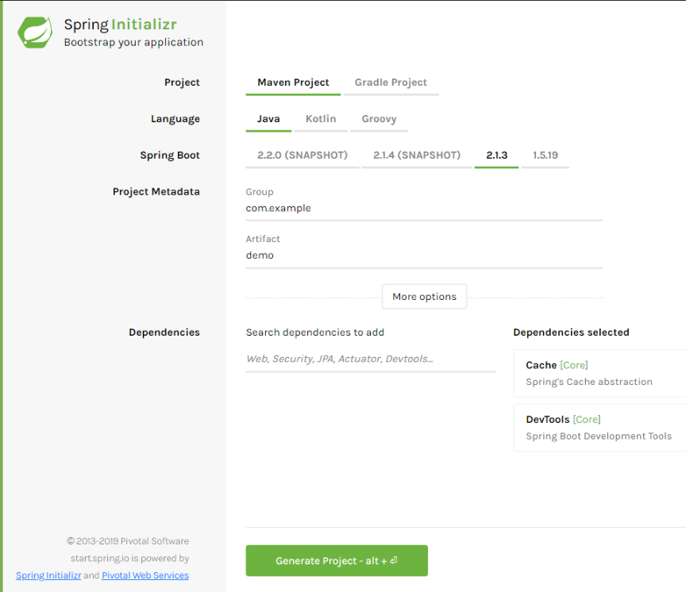

# On joue à cache cache avec Spring Boot

En tant que développeur, nous sommes très souvent confrontés à des problèmes de performance dans nos applications.

Comment fonctionne la majorité des applications ? On va récupérer des données dans une base de données, effectuer un ou plusieurs traitement ou calcul et renvoyer le résultat à l'utilisateur.

C'est un peu brut, prenons un exemple : Un site de vente en ligne et l'affichage d'une page d'un produit. Comment cela fonctionne dans la majorité des cas ?

- Un visiteur du site veut afficher le produit
- On va lancer une requête pour récupérer les données du produit
- On va lancer une seconde requête pour voir si le produit est en stock
- Ensuite on va récupérer les images du produit
- Notre produit est surement le meilleur du monde et nous allons donc le mettre en avant avec des commentaires positifs donc on va lancer des requêtes pour récupérer ces commentaires et les noms des personnes qui ont déposés les commentaires
- Nous allons faire appel à un service externe pour récupérer par exemple le délai de livraison du produit
- Une fois que nous avons toutes ces données, nous allons générer la page HTML / CSS et l'afficher à notre visiteur

Arrive maintenant un 2e visiteur sur notre site, qui va afficher le même produit. Nous allons donc relancer tout le traitement précédant. Et pareil pour les milliers de visiteurs suivants et au bout d'un moment la base de données ne suivra plus.

(Bon ok mon exemple n'est pas pertinent car en toute logique dans ce cas la base de données ne lancera pas milles fois la requête, elle conservera les données en mémoire ...)

Finalement entre chaque visiteur quelles sont les données qui sont susceptibles d'être modifiée entre chaque affichage ? La quantité en stock du produit ? 

Dans toute application il faut se poser la question de savoir à quelle fréquence les données vont être mise à jour et à quelle fréquence notre application va devoir interroger la base de données.

Un cache applicatif permet à notre application de stocker temporairement certains objets ou résultats de calculs complexes. 

Spring Boot propose un mécanisme de cache simple et efficace, voyons un exemple.

## Création du projet

On va créer un projet sur https://start.spring.io/ :



Dans les dépendances on va ajouter *Cache* et *DevTools*.

On télécharge le projet, on l'ouvre avec notre éditeur préféré, vous connaissez la chanson.

Ensuite nous allons créer une entité 'Contact' :

```java
package com.example.demo.entity;

public class Contact {
    long id;
    String nom;
    String prenom;
    String telephone;
    
    @Override
    public String toString() {
        return "Contact [id=" + id + ", nom=" + nom + ", prenom=" + prenom + ", telephone=" + telephone + "]";
    }
    // + getters et setters
}
```

Ensuite nous allons créer un *Repository* qui va simuler un accès à une base de données ou à un service externe qui va nous retourner un contact selon un id :

``` java
package com.example.demo;

import org.springframework.stereotype.Component;
import com.example.demo.entity.Contact;

@Component
public class ContactRepository {

    public Contact getById(long id) {
        simulationDUneLenteur();
        Contact contact = new Contact();
        contact.setId(id);
        contact.setNom("Contact " + id);
        contact.setPrenom("Prénom " + id);
        contact.setTelephone(Long.toString(id * 1111111111));
        return contact;
    }

    private void simulationDUneLenteur() {
        try {
            long time = 4000L;
            Thread.sleep(time);
        } catch (InterruptedException e) {
            throw new IllegalStateException(e);
        }
    }
}
```

On aurait pu accéder à une base de données, mais ici l'idée est simplement de créer un service qui sera très lent : chaque appel à la fonction getByiId va durer 4 secondes.

Nous allons maintenant utiliser ce Repository au lancement de l'application en utilisant une classe de type *CommandLineRunner* :

```java
package com.example.demo;

import org.slf4j.Logger;
import org.slf4j.LoggerFactory;
import org.springframework.beans.factory.annotation.Autowired;
import org.springframework.boot.CommandLineRunner;
import org.springframework.stereotype.Component;

@Component
public class App implements CommandLineRunner {

    private static final Logger logger = LoggerFactory.getLogger(App.class);

    @Autowired
    private ContactRepository contactRepository;

    @Override
    public void run(String... args) throws Exception {
        logger.info("contact 1 =>" + contactRepository.getById(1));
        logger.info("contact 2 =>" + contactRepository.getById(2));
        logger.info("contact 3 =>" + contactRepository.getById(3));
        logger.info("contact 1 =>" + contactRepository.getById(1));
        logger.info("contact 1 =>" + contactRepository.getById(1));
    }
}
```

Dans *Spring Boot* toutes les classes qui implémentent *CommandLineRunner* sont lancées automatiquement au démarrage du projet. 

Démarrons l'application et voyons les logs :

```
2019-03-07 13:57:50.875  INFO 23984 --- [  restartedMain] com.example.demo.App                     : contact 1 =>Contact [id=1, nom=Contact 1, prenom=Prénom 1, telephone=1111111111]
2019-03-07 13:57:54.875  INFO 23984 --- [  restartedMain] com.example.demo.App                     : contact 2 =>Contact [id=2, nom=Contact 2, prenom=Prénom 2, telephone=2222222222]
2019-03-07 13:57:58.876  INFO 23984 --- [  restartedMain] com.example.demo.App                     : contact 3 =>Contact [id=3, nom=Contact 3, prenom=Prénom 3, telephone=3333333333]
2019-03-07 13:58:02.877  INFO 23984 --- [  restartedMain] com.example.demo.App                     : contact 1 =>Contact [id=1, nom=Contact 1, prenom=Prénom 1, telephone=1111111111]
2019-03-07 13:58:06.878  INFO 23984 --- [  restartedMain] com.example.demo.App                     : contact 1 =>Contact [id=1, nom=Contact 1, prenom=Prénom 1, telephone=1111111111]
```

Comme prévu chaque récupération du contact dure 4 secondes (voir le timestamp), même pour le contact 1 alors qu'on le récupère plusieurs fois.

## Mise en oeuvre du cache

On va mettre en place le cache dans le repository avec l'annotation *@Cacheable* :

```java
    @Cacheable("contacts")
    public Contact getById(long id) {
        simulationDUneLenteur();
        Contact contact = new Contact();
        contact.setId(id);
        contact.setNom("Contact " + id);
        contact.setPrenom("Prénom " + id);
        contact.setTelephone(Long.toString(id * 1111111111));
        return contact;
    }
```

Et on va activer le cache sur l'application avec *@Cacheable* :

```java
package com.example.demo;

import org.springframework.boot.SpringApplication;
import org.springframework.boot.autoconfigure.SpringBootApplication;
import org.springframework.cache.annotation.Cacheable;

@EnableCaching
@SpringBootApplication
public class DemoApplication {
    public static void main(String[] args) {
        SpringApplication.run(DemoApplication.class, args);
    }
}
```

Au démarrage de l'application, *Spring Boot* va scruter toutes les classes et activer le cache sur les fonctions annotées avec *@Cacheable*, et va également configurer un **CacheManager** par défaut.

On relance l'application :

```
2019-03-07 14:26:18.383  INFO 19836 --- [  restartedMain] com.example.demo.App                     : contact 1 =>Contact [id=1, nom=Contact 1, prenom=Prénom 1, telephone=1111111111]
2019-03-07 14:26:22.383  INFO 19836 --- [  restartedMain] com.example.demo.App                     : contact 2 =>Contact [id=2, nom=Contact 2, prenom=Prénom 2, telephone=2222222222]
2019-03-07 14:26:26.384  INFO 19836 --- [  restartedMain] com.example.demo.App                     : contact 3 =>Contact [id=3, nom=Contact 3, prenom=Prénom 3, telephone=3333333333]
2019-03-07 14:26:26.385  INFO 19836 --- [  restartedMain] com.example.demo.App                     : contact 1 =>Contact [id=1, nom=Contact 1, prenom=Prénom 1, telephone=1111111111]
2019-03-07 14:26:26.385  INFO 19836 --- [  restartedMain] com.example.demo.App                     : contact 1 =>Contact [id=1, nom=Contact 1, prenom=Prénom 1, telephone=1111111111]
```

La récupération du contact 1 est désormais immédiate pour le 2e et 3e appel : Sping Boot va récupérer l'objet stocké dans son cache au lieu de lancement le traitement lent *getById*, notre application est plus performante sans avoir modifié le code qui retrouve les contacts.

## Cache et péremption des données

Attention aux données stockées en cache. Il ne faudra y stocker que des données qui sont longues à être générées (Résultat de calculs complexes, interrogation de services externes qui peuvent être long, des statistiques qui n'ont pas exemple pas besoin d'être actualisée souvent) et des données qui ne bougent pas dans le temps.

Revenons sur l'exemple de notre contact, on affiche un contact récupéré depuis le cache, si le contact a été modifié en base de donnée, alors c'est toujours l'ancienne version du contact qui sera affiché !

Si le contact est modifié dans l'application, on pourra utiliser l'annotation *@CachePut* sur les méthode update pour préciser au cache qu'il faut mettre à jour l'enregistrement :

```java
@CachePut
public User updateContact(Contact contact) {
    ...
}
```

Si la donnée est récupérée depuis un système externe, alors nous n'avons aucun moyen d'être avertit d'une modification et une solution sera de supprimer les données en cache selon une période définie avec l'annotation *@CacheEvict*. Il faudra alors trouver un compris entre les performances de l'application et la mise à jour des données. 

Le code se trouve dans mon repo Github.

Je vous invite à lire la documentation sur le cache Spring Boot : 

https://docs.spring.io/spring/docs/current/spring-framework-reference/integration.html#cache
https://docs.spring.io/spring-boot/docs/current/reference/html/boot-features-caching.html
